# Bulletin

いわゆる「電光掲示板」風な表示のニュースリーダーです.

<picture>
  
</picture>

<p>

[RSS ニュース](https://www.google.co.jp/search?q=rss+%E3%83%8B%E3%83%A5%E3%83%BC%E3%82%B9)
を読むためのアプリです.
なぜそんなものをいまさら持ち出したのかというと,
[新幹線車内のニュース提供](https://www.google.co.jp/search?q=%E6%96%B0%E5%B9%B9%E7%B7%9A+%E6%96%87%E5%AD%97%E3%83%8B%E3%83%A5%E3%83%BC%E3%82%B9)
が終わってしまったことを残念に感じたことが動機です.
そんな動機で始めたので, 電光掲示板風にスクロール表示するものをわざわざ手作りしたわけです.

## 運用

基本的に[RSS](https://ja.wikipedia.org/wiki/RSS)リーダーなので,
「どこが提供しているニュースを表示させるか」をお好みに応じて設定することになります.
その設定は右クリックメニューを通して行います.

アプリの表示上でマウスを右クリックすると, こんなのが出ます.

<picture>
  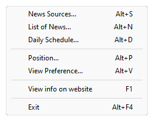
</picture>

このメニューの内容は下表の通りです.

| メニュー項目 | 目的 |
| --- | --- |
| [News Sources...](#news-sources) | ニュース提供元 ( いわゆる「[RSS feed](https://www.google.com/search?q=rss+feed)」 ) を選ぶ. |
| [List of News...](#list-of-news) | 読み取ったニュース一覧を表示する. |
| [Daily Schedule...](#daily-schedule) | 日課を表示・設定する. |
| [Position...](#position) | 表示位置を選ぶ. |
| [View Preference...](#view-preference) | 表示を好みに合わせる. |
| [View info on website](#view-info-on-website) | 本アプリのウェブサイト ( 今お読みになっているココ ) を見る. |
| [Exit](#exit) | アプリを終了する. |

以下, それぞれについての説明です.

### News Sources

右クリックメニューの `News Sources...` を選ぶと, 下記のようなダイアログが現れます.

<picture>
  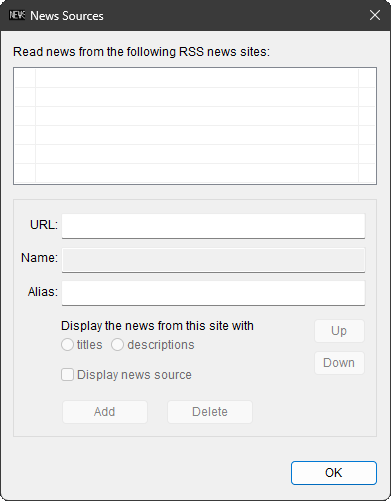
</picture>

今までに選んだニュース提供元が表示されますが, まだどこも選んでいない場合には上図のように空っぽな表示になります.

とりあえずこのダイアログはいったんおいて,
ウェブで「[RSS ニュース](https://www.google.co.jp/search?q=rss+%E3%83%8B%E3%83%A5%E3%83%BC%E3%82%B9)」
を探してみましょう.
提供元のサイトによって,
何やらオレンジ色のマークだったりただのリンクだったりしますが,
RSSのニュースに辿り着くと,
`http://`や`https://`で始まり, `.xml` や `.rdf` や `/` で終わる URL のウェブページに,
ごちゃごちゃと文字列が表示されているはずです.
そこの URL を Copy しておきましょう.

で, 先ほどのダイアログに戻って, 下図のように `URL:` のところに Paste します.

<picture>
  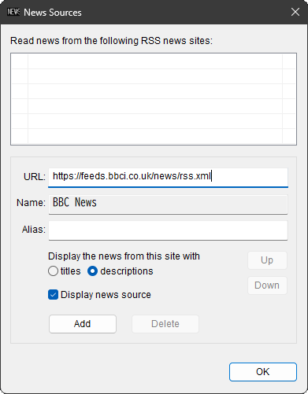
</picture>

Paste した URL がたしかに RSS ニュースの提供元だった場合,
`Name:` のところになにがしかの文字列 ( たいてい提供元の名前 ) が現われます.

そして `Add` ボタンを押します.

<picture>
  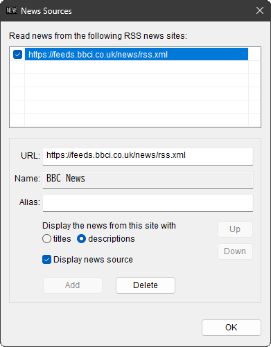
</picture>

すると, 上図のようにさっき Paste した URL が上のリストに加わります.

<picture>
  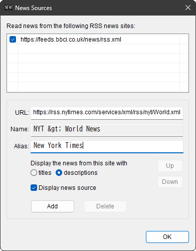
</picture>

同じ要領で, お好みのニュース提供元を加えていきます.
加え終わったら `OK` を押して確定です.

<picture>
  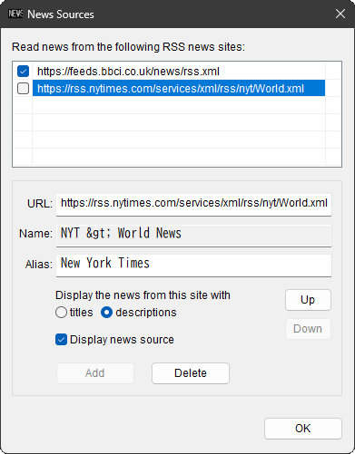
</picture>

リスト左のチェックは, 外しておくと読むのをスキップします.
「今日は読まないけど, また URL を探すのも面倒なので, とりあえずキープはしておきたい」というニュース提供元は,
この「チェックを外しておく」でやり過ごしておきましょう.

「いや, もう読むことはないな」というニュース提供元は,
`Delete` ボタンを押して登録抹消です.

`titles` と `descriptions` という二つの選択肢がありますが,
`descriptions` の方が一般的に長い文章で細かい記述の記事が読めます.
`titles` しか提供していない提供元もありますが, その場合は `titles` 一択になります.
「`descriptions` では読むのが面倒」と思われた場合は, `titles` を選んでおきます.

`Display news source` というチェックは,
スクロール表示される各ニュース記事の前に, ニュース提供元の名前 (`Name:`) を添えるためのものです.
元祖新幹線の掲示板がニュースソースを明示する仕様だったので, それに倣ってみました.
オリジナルの名前が長すぎるとかピンとこないとか思われた場合は,
お好みの別名 (`Alias:`) を付けることもできます.

リスト上でいずれかの URL を選んで `Up` `Down` ボタンで順序を替えられます.
このリスト上に並んでいる順序で掲示板に表示されることになります.

### List of News

右クリックメニューの `List of News...` を選ぶと, 下記のようなダイアログが現れます.

<picture>
  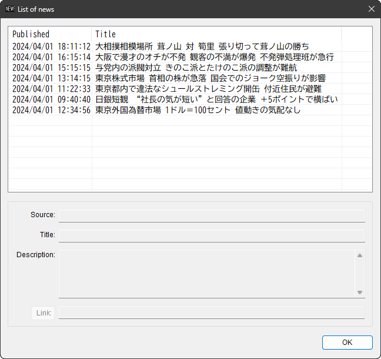
</picture>

現在までに入ってきているニュースの一覧を表示しています.

スクロールを見逃したときなどに, 全てのニュースを見返すのに便利です.

リストのいずれかの行をクリックすると, その行の提供元や　( 提供元が添えている場合 ) `description` が,
下図のようにダイアログ下部に表示されます.

<picture>
  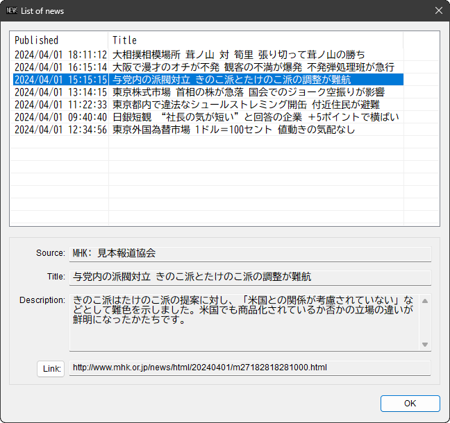
</picture>

この状態で `Link:` ボタンを押すと, ニュースの詳細をウェブブラウザーで確認することができます.

リストのヘッダーの `Published` をクリックすると記事の発行日時でソートされ,
`Title` をクリックすると記事の見出しでソートされます.
どちらのソートもかけないときは, ニュースの発行元が書いたオリジナルの順番に並びます.

<picture>
  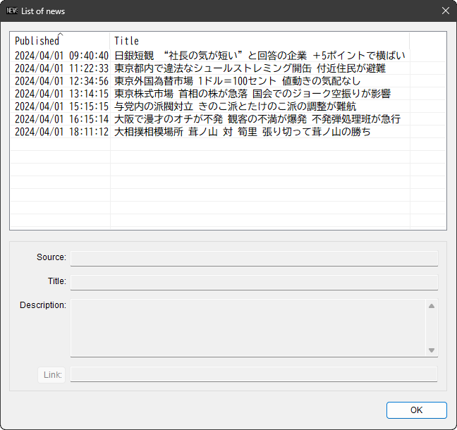
</picture>

ソートされた状態で `OK` ボタンを押してこのダイアログを閉じると,
掲示板の表示も指定されたソート順に並べ替えられます.

### Daily Schedule

日課となっているスケジュールを表示・設定します.

スケジュールの記述は, 任意のテキストファイルに行います.
メモ帳等であらかじめ作っておきます.
下記のように記述しておきます.

```
11:50	そろそろ、{+おひるごはん}です。
11:57	!まもなく、{+おひるごはん}です。食卓に着く前に手を洗いましょう。
12:00	|!{+おひるごはん}
13:00	|次は　{+ばんごはん}
```

行の冒頭には, 表示する時刻を記述します.
日課なので毎日同じことを繰り返す前提になっており, 日付の指定はありません. 時刻だけです.
秒の記述を省略した場合は, 00秒と見なします. 時と分は必須です.

時刻指定からスペースやタブを挟んで, 表示する文言を記述します.

この文言の記述には, 以下のような表示を制御するための文法があります.

| 記述 | 表示 |
| --- | --- |
| 文言の前の `\|` | スクロールを止めて, 中央に表示する. |
| 文言の前の `!`  | 次のスケジュールまで表示し続ける. この指定がないと1分で表示終了. |
| 文言の前の `#`  | `#` のあとに記述された `.wav` ファイルを鳴らす. |
| 任意の場所の `{+` | `}` までの文字列を強調表示 ( 黄色 ) する. |
| 任意の場所の `{-` | `}` までの文字列を反転表示する. |
| 任意の場所の `{#xxxxxx` | `}` までの文字列を `xxxxxx` の16進数で RGB 指定された色で表示する. |
| 空の行　　　　　| 単に無視するだけ. |

このようにして作っておいたテキストファイルを, 任意のフォルダにセーブしておきます.

そして, メニューから `Daily Schedule` を選ぶと下図のようなダイアログが現われますので,
`File:` のところにセーブしておいたテキストファイル名をフルパスで打ち込むか,
隣の `>>` を押してテキストファイルを選ぶかします.

<picture>
  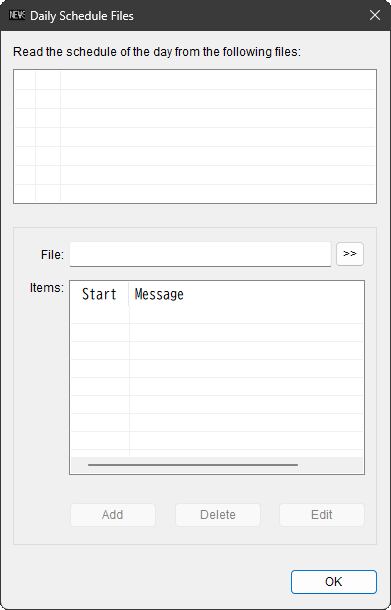
</picture>

選んだテキストファイルが正しい記述になっていれば,
下図のように `Items:` 欄にテキストファイルの内容が示されます.

<picture>
  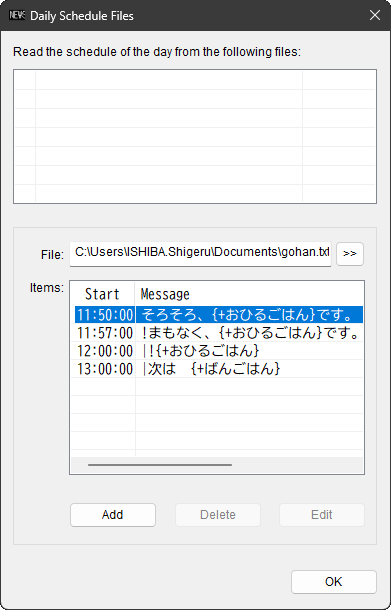
</picture>

ここで `Add` を押せば,
下図のように選んだテキストファイルがリストに加わります.

<picture>
  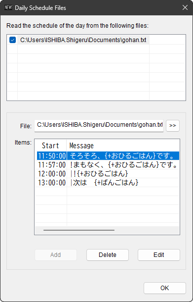
</picture>

こうしておくと, それぞれの日課の指定時刻が来るたびに,
その文言が普段のニュース表示に割り込んで表示されます.

複数のファイルが指定でき, リスト上のチェックを外すとスキップできるのは,
[News Sources...](#news-sources) と同様です.

この Daily Schedule のサンプルを, いくつか [Examples](Examples/README.md) に上げておきました.

### Position

掲示板が表示される位置を選びます.

選べるのは下図が示す通り, モニター画面の左上端・上端中央・右上端・左下端・下端中央・右下端 の6か所です.

<picture>
  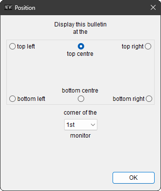
</picture>

また, 表示するモニターも選べます.
プライマリーモニターではなく, セカンダリーモニターに表示する場合は,
ダイアログの下の方のコンボボックスで `2nd` を選びます.

### View Preference

表示をお好みに合わせて調整します.

下図のようなダイアログが現れます.

<picture>
  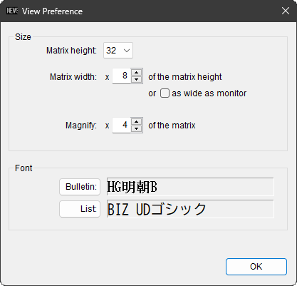
</picture>

| メニュー項目 | 目的 |
| --- | --- |
| Matrix Height: | 電光掲示板のドットマトリクスの高さ ( 縦方向のドット数 ≒ 文字の大きさ ) を選ぶ.<br>選択肢は 16・24・32・48・72 の5パターン. |
| Matrix Width: | 電光掲示板のドットマトリクスの幅が高さの何倍か ( ≒ 漢字文字数 ) を選ぶ.<br>有効範囲は `x 1` からモニターの幅に収まる限界まで. |
| as wide as monitor | 上記を無視して, モニターの幅いっぱいまで. |
| Magnify | フォントのドットマトリクスを何倍に表示するかを選ぶ.<br>有効範囲は `x 1` から常識の範囲で. |
| Bulletin: | 電光掲示板のフォントを選ぶ.<br>電光掲示板に表示されるフォントに適用. |
| List: | リストのフォントを選ぶ.<br>[List of News...](#list-of-news) や [Daily Schedule...](#daily-schedule) の `Items:` のリストなどのフォントに適用. |

フォントを選ぶボタンを押すと, 下図のようなダイアログがさらに現れます.

<picture>
  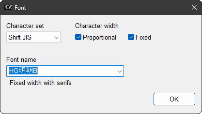
</picture>

お好みでフォントを選んでください.
選んだフォントのイメージが `View Preference` のダイアログで確認できます.

### View info on website

ブラウザーで今ごらんになっているページを開きます.

ヘルプの代わりです. 正直, ヘルプファイルを作るのが面倒だったんです.

### Exit

本アプリを終了します.

変更した設定は, この終了時にレジストリに保存します.

## 操作

本アプリの GUI に対しては, 以下の操作が有効です.


| 操作 | 動作 |
| --- | --- |
| マウスで左クリック  | 普通にアクティブになるだけ. |
| `Ctrl` + 左クリック | 今通過中のニュースのウェブサイトを開く. |
| マウスで右クリック  | [メニュー](#運用)を出す. |
| `Alt` + `S`  | [News Sources...](#news-sources) |
| `Alt` + `N`  | [List of News...](#list-of-news) |
| `Alt` + `D`  | [Daily Schedule...](#daily-schedule) |
| `Alt` + `P`  | [Position...](#position) |
| `Alt` + `V`  | [View Preference...](#view-preference) |
| `F1`         | [View info on website](#view-info-on-website) |
| `F5`         | ニュースをリロードする. |
| `Alt` + `F4` | [Exit](#exit) |
| [Menu Key](https://en.wikipedia.org/wiki/Menu_key)　　　　 | [メニュー](#運用)を出す. |
| `Esc`        | [メニュー](#運用)が出ていればそれを閉じる / 出ていなければアプリ自体を閉じる. |

タブレットでのタッチパネル操作は眼中にありません.
このアプリは複数のモニターが接続された PC で,
正直ヒマそうにしているモニター上で遊ぶことをなんとなく前提にしています.

## 環境

* Visual Studio 2022&reg; での Windows11 向け build なので, 64bit OS 用です.
* 同じ build で Windows10 でも問題なく動作しますが, 64bit 版に限ります.

## 動作

アプリ起動時と毎正時 ( xx:00 ) **頃**に,
指定されたニュース提供元のサイトから最新ニュースを読み取ります.
あとはそれをスクロール表示しているだけです.
「**頃**」というのは, 毎正時になったときに表示していた記事が, 「全てスクロールアウトしてから」 読み取りを開始するため,
実際の読み取り時刻にはブレがあることを意味します.
サーバーへの負荷集中を避けるための謙虚な動作です.

表示処理としては,

1. 表示する記事のテキストを内蔵の bitmap にグラフィックスで書き込んでおく.
1. 表示画面全体を左へ 1ドット分スクロールする.
1. 内蔵 bitmap の右端の 1ドット分だけ表示画面に転写 ( [`StretchBlt()`](https://learn.microsoft.com/en-us/cpp/mfc/reference/cdc-class?view=msvc-170#stretchblt) ) する.
1. 表示画面の右端の 1ドット分だけグリッドを描く.

といったものです. 1. は一つの記事に1回だけ行うことであり, 大半の時間は 2. 〜 4. しか行っていません.
とは言っても,
この 2. 〜 4. は 15ms 毎に繰り返している ( それぐらいの時間でないとそれっぽいスクロール速度にはならない ) ので,
処理が軽くなるように工夫してみたわけです.

しかし, 「15ms」という数字は, Windows のタイマーの ( デフォルトの ) 分解能 15.625[ms] ( 1000/64[s] ) を下回る短さです.
こんなに短いタイマー値では, お願いした通りの時間経過でタイマーが発動するとは限りません.
本アプリ開発中に「そもそもタイマーってどうなの？」を検証するために [TP](../TP/README.md) ( Test Program ) を作って,
色々と検証してみて, その結果を踏まえて本アプリのタイマーの在り方を選びました.
その結論が下記の通りです.

* [`SetTimer`](https://learn.microsoft.com/en-us/windows/win32/api/winuser/nf-winuser-settimer) ではスクロールがぎこちなくなる PC があったので, [`SetWaitableTimer`](https://learn.microsoft.com/en-us/windows/win32/api/synchapi/nf-synchapi-setwaitabletimer) を使用.
*  [`timeBeginPeriod`](https://learn.microsoft.com/en-us/windows/win32/api/timeapi/nf-timeapi-timebeginperiod) を使うと CPU 使用率が上がる PC があったので, ( デフォルトでは ) 不使用.

`timeBeginPeriod` に関しては, [TP](../TP/README.md) では使ってもそれほど CPU 使用率が上がりはしませんでしたが,
それはタイマー起動される処理の軽さによるものでしょう.
本アプリでは, タイマー起動される処理の中にグラフィックス操作が含まれるのですが, それが集計しかしていない TP とは異なります.
この違いが如実に数字に表れました.
( CPU の余力の差か, ディスプレイアダプターの性能の差か, その両方かは判りませんが. )

あと, あらかじめグリッドを描いたオーバーレイウィンドウを被せておいて,
上記表示処理の 4. を省略したらもっとタイムが削れるかな, とセコいことを試してみたのですが,
なぜか `dwm.exe`
( [Desktop Window Manager](https://learn.microsoft.com/en-us/windows/win32/learnwin32/the-desktop-window-manager) )
の CPU 使用率が上振れする PC があったので, この方式は不採用としました.

代わりに 4. のグリッドを描く範囲を「更新された矩形の中だけに限定する」というセコい処理内容に改めたところ,
だいぶ CPU 使用率が低減できたので, そのセコい処理を採用しました.
( Windows の描画処理って, 更新された矩形の分しか処理時間がかからないのかと思っていましたが, そうではないんですね. )

こうしたセコい努力の結果, かなり非力な PC で使っても,
[Task Manager](https://en.wikipedia.org/wiki/Task_Manager_(Windows))
の ( 小数点以下四捨五入な ) CPU 使用率は“00”% に抑えられています
( 常に表示を動かしているにもかかわらず ).

## 実装

せっかく「ソース置き場」である github に上げたので, ソースの見どころも少しご案内しておきます.

[BulletinDlg.cpp](https://github.com/inhouse-tool/Bulletin/blob/master/Bulletin/Bulletin/BulletinDlg.cpp)
の中にある `CBulletinDlg::PlaceWindow( void )` 以下 `CBulletinDlg::OnEnumDisplay()` までの 3 関数は,
マルチモニター環境で「どのモニターかを選ぶ」という機能を実装するときに便利かもしれません.

[BulletinDlg.cpp](https://github.com/inhouse-tool/Bulletin/blob/master/Bulletin/Bulletin/BulletinDlg.cpp)
の中にある `CBulletinDlg::LoadWeb( CString strURL )` は,
指定されたウェブページの中身を文字列で返す関数です.
ウェブページのチェックに便利かもしれません.
<sub>
( RSS の読み込みなら XML 構文に対応した
 [`XmlTextReader`](https://learn.microsoft.com/en-us/dotnet/api/system.xml.xmltextreader)
を使うのが「Microsoft的流儀」に適うのかもしれませんが, アレって C# に偏った実装で, C++ で使うとイマイチなんですよね.
[/clr を強要してくるし](https://learn.microsoft.com/en-us/cpp/build/reference/clr-restrictions). )
</sub>


[BulletinDlg.cpp](https://github.com/inhouse-tool/Bulletin/blob/master/Bulletin/Bulletin/BulletinDlg.cpp)
の中にある `CBulletinDlg::LoadText( CString strFile )` 以下 `CBulletinDlg::GetTextEncode()` までの 2 関数は,
与えられたパスのファイルの中身を文字列で返す関数です.
各種エンコード ( ASCII・Shift JIS・UTF-8・UTF-16 ) に対応しているので, 地味に便利かもしれません.

あと,
[WTimer.h](https://github.com/inhouse-tool/Bulletin/blob/master/Bulletin/Bulletin/WTimer.h)
・
[WTimer.cpp](https://github.com/inhouse-tool/Bulletin/blob/master/Bulletin/Bulletin/WTimer.cpp)
で構成される `CWTimer` クラス は,
[Waitable Timer](https://learn.microsoft.com/en-us/windows/win32/sync/using-waitable-timer-objects)
を手軽に使えるようにするためのものです.
Waitable Timer ってタイマーの満了を待つ別スレッドが必要なので,
message driven に構成される普通の C++ の実装とは相性が悪いと思います.
このクラスは, タイマー満了を window message で伝えるようにし,
またスレッドの後片付けも内部で自動的に済ませるようにしてあります.

<div style="text-align: right;">
In-house Tool / 家中 徹
</div>
